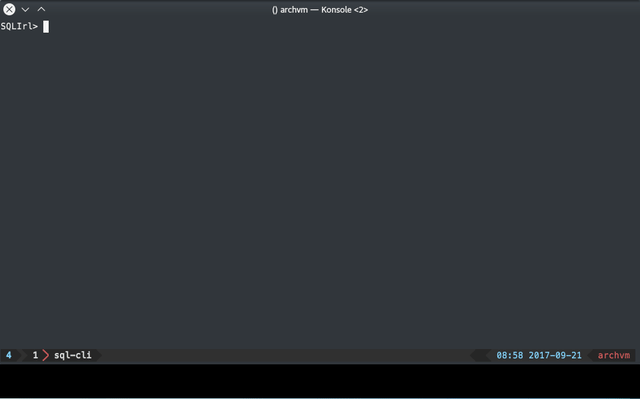

Readline
==========

fork of readline made by  [chzyer](https://github.com/chzyer)

readline: [https://github.com/chzyer/readline](https://github.com/chzyer/readline)

I wanted a feature to transform the output of the input buffer
and since chzyer doesn't seem active [#121](https://github.com/chzyer/readline/pull/121)
so I just created this fork

Highlighter example:



Snip of the sample gif shown above
Highlighting with [chroma](github.com/alecthomas/chroma)

```go
package main

import (
  "bytes"
  "log"

  "github.com/alecthomas/chroma/quick"
  "github.com/gohxs/readline"
)

func display(input string) string {
  buf := bytes.NewBuffer([]byte{})
  err := quick.Highlight(buf, input, "postgres", "terminal16m", "monokai")
  if err != nil {
    log.Fatal(err)
  }
  return buf.String()
}
func main() {
  log.SetFlags(log.Lshortfile | log.LstdFlags)
  term, err := readline.NewEx(&readline.Config{
    Prompt: "SQLIrl> ",
    Output: display,
  })
  if err != nil {
    log.Fatal(err)
  }
  for {
    line, err := term.Readline()
    if err != nil {
      log.Fatal(err)
    }
    //... do things
    log.Println("E:", line)
  }
}
```

